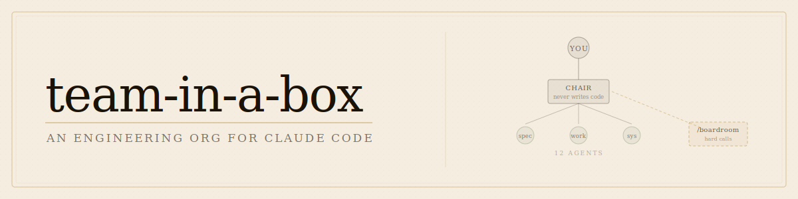
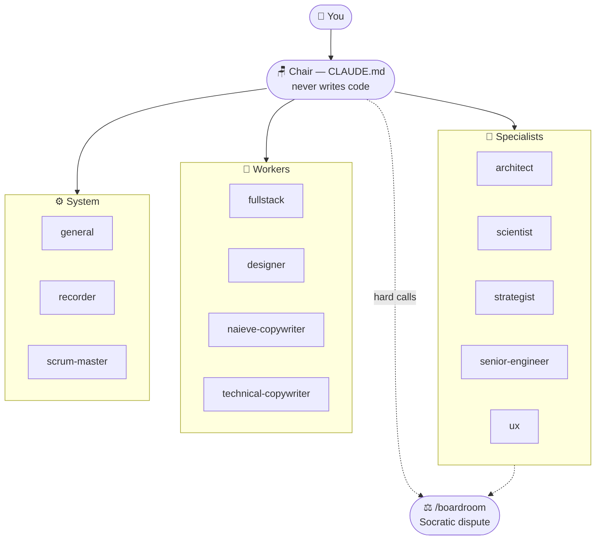

<div align="center"></div>

# team-in-a-box

<div align="center">

**One orchestrator seat. A manager who never writes code. Twelve employees you talk to 1:1. A boardroom for the hard calls.**

[](LICENSE)
[](https://claude.ai/download)
[](https://github.com/TheNickRains/team-in-a-box/stargazers)
[](https://github.com/TheNickRains/team-in-a-box/commits/main)

</div>

---

This is an org chart, not a persona label. You drive complex products from a single orchestrator seat — you talk to the manager, the manager runs the company.



Work flows **You → Chair → agent → back to Chair**. Agents never coordinate directly. The chair is the single point of context, sequence, and accountability.

→ [Jump to Install](#install)

---

## The three things that make this different

**1. Employees you talk to 1:1.**
Every seat is a real `claude --agent` session — its full charter, journal, and principles loaded. Pull any specialist into a room:

```bash
claude --agent architect       # schema, tradeoffs, ADRs
claude --agent fullstack       # end-to-end implementation
claude --agent strategist      # what to cut, what to build next
```

This is not a subagent firing invisibly inside your chat. It's a conversation with a specialist who knows what they own and what they don't.

**2. A manager with a subconscious.**
The chair never writes a line of code. It routes, holds context, convenes boardrooms, and demands cited file paths from everyone it talks to.

Run `/charter` once and the chair gets seeded with a living profile of how you think — your decision patterns, friction triggers, failure modes. The profile starts as a hypothesis and gets corrected by observation. The machine learns how *you* decide.

**3. A boardroom for hard calls.**
When a decision crosses domains or is hard to reverse:

```
/boardroom architect,scientist,senior-engineer what's the right data model for X
```

Each persona holds a position, names their assumption, and states the one falsifiable test that would change their mind. Output: a decision + the next experiment, logged to the decisions-log. Not consensus — Socratic dispute.

---

## What this is NOT

- **Not a role pack.** Role packs give Claude a persona label. This gives it an org chart, a chain of command, and memory of what went wrong.
- **Not auto-dispatched invisible subagents.** There is no one to talk to in those systems. Here, every seat has a charter, principles, and a journal. You pull them into the room.
- **Not a process framework.** Process frameworks tell you how to structure work. This tells your agents who owns what, who never writes code, and who calls "done."
- **Not a configuration you forget about.** The chair's profile of how you decide gets sharper every session. The agents log what went wrong. The machine learns.

---

## The 12 seats

| Seat | Class | Domain | Summon |
|------|-------|--------|--------|
| 🏛️ architect | 🧠 | Schema, data model, structural tradeoffs, ADRs | `claude --agent architect` |
| 🔬 scientist | 🧠 | Algorithm, signal extraction, domain-specific evaluation | `claude --agent scientist` |
| 🧭 strategist | 🧠 | Prioritization, scope cuts, what-to-build-next | `claude --agent strategist` |
| 🔍 senior-engineer | 🧠 | Pre-mortem, refactor-vs-ship, technical debt | `claude --agent senior-engineer` |
| 🗺️ ux | 🧠 | User flows, edge cases, wireframes — hard gate before UI starts | `claude --agent ux` |
| ⚡ fullstack | 🔧 | End-to-end implementation: routes, APIs, infra | `claude --agent fullstack` |
| 🎨 designer | 🔧 | UI, motion, layout hierarchy — never writes copy | `claude --agent designer` |
| ✏️ naieve-copywriter | 🔧 | First-touch surfaces: hero, landing, onboarding (5th-grade cap) | `claude --agent naieve-copywriter` |
| 📝 technical-copywriter | 🔧 | Downstream copy: dashboard, investor narrative, blog, SEO | `claude --agent technical-copywriter` |
| 🚦 general | ⚙️ | WIP discipline, headlights enforcer — call when too much is in flight | `claude --agent general` |
| 🎙️ recorder | ⚙️ | Compression only — pre-digests artifacts before boardroom spawns | `claude --agent recorder` |
| 📋 scrum-master | ⚙️ | Living kanban, worktree lifecycle, calls "done" | `claude --agent scrum-master` |

**Each agent is three things:** a charter (`.claude/agents/<name>.md`), a principles log (what went wrong), and a session journal (long-term memory across sessions). Agents without journals start cold. Agents without principles repeat mistakes.

**Legend:** 🧠 Specialist — advises, shapes, pressure-tests; produces judgment not code | 🔧 Worker — executes; produces the artifact | ⚙️ System — org infrastructure; supports the machine, not the product

<details>
<summary>⊕ Adding a seat</summary>

Create three things:

1. `.claude/agents/<name>.md` — the charter. Five parts: identity, domain ownership, hard rules, a `## Principles` section (grows as the agent learns what went wrong), and context to load at boot.
2. A journal stub in your KB (e.g. `git kb create context/extensible/journals/<name>`) — append-only markdown; long-term memory across sessions.
3. One line in `AGENTS.md` — the description is the routing signal the chair reads to decide who to call.

The agent frontmatter:

```yaml
---
name: <name>
description: <one-line invoke trigger — specific enough to route correctly, exclusive enough to avoid mis-routing>
model: claude-sonnet-4-6
tools: Read, Edit, Write, Bash
---
```

Three failure modes to avoid:

- **Agent without a journal** — no memory between sessions; starts cold every time.
- **Agent without Principles** — can't self-learn mid-conversation; same mistakes repeat.
- **Agent with a vague description** — won't get called for the right thing; chair will mis-route.

A complete agent is all three. Anything less is a costume.

</details>

---

## Install

> **Prerequisites**
> Requires [Claude Code](https://claude.ai/download) — Anthropic's CLI. Install it before running setup.

> **What `setup.sh` does (and doesn't do)**
> Substitutes tokens in markdown files, creates `.kb/` directories, seeds the KB with starter task stubs, and attempts to symlink `git kb` into `~/.local/bin`. It does not require `sudo` — it warns and continues if the symlink step fails.

```bash
# Clone (with git history)
git clone https://github.com/TheNickRains/team-in-a-box my-project
cd my-project

# Or degit (clean slate, no history)
npx degit TheNickRains/team-in-a-box my-project
cd my-project
```

Then run the setup interview:

```bash
./setup.sh
```

The interview asks six questions — no surprises mid-run:

1. **Project name** — replaces tokens across all charters
2. **Your name** — wired into the chair identity and boardroom prompts
3. **Product description** — one sentence
4. **Stack** — e.g. `Node / TypeScript / Postgres`
5. **Deploy command** — wired into the chair's context block
6. **Which seats to activate** — `all` or a comma list

After answering, `setup.sh` substitutes all tokens, renders `CHARTER.md`, prunes unselected seats, symlinks `git kb` onto PATH, seeds the KB doc stubs, and drops one starter task on the board.

**The ready signal:**

```
=======================================================
  my-project is ready.
=======================================================

Board:
[ ready ] First task: run /charter to seed your operating charter
```

**What to do first:**

1. Seed your operating charter — the chair's profile of how you think

   ```bash
   /charter
   ```

2. Open a 1:1 with a specialist

   ```bash
   claude --agent strategist
   ```

3. Commit the initialized project

   ```bash
   git add -A && git commit -m "init: team-in-a-box setup"
   ```

<details>
<summary>⚙️ Non-interactive / CI install</summary>

Pass `--yes` (or `--defaults`) to skip the interview and use defaults or env overrides:

```bash
./setup.sh --yes
```

Per-token env overrides for automated installs:

| Variable | What it sets |
|----------|-------------|
| `TIAB_PROJECT_NAME` | Project name |
| `TIAB_HUMAN_NAME` | Your name |
| `TIAB_PROJECT_DESCRIPTION` | One-sentence product description |
| `TIAB_STACK_DESCRIPTION` | Stack string |
| `TIAB_DEPLOY_INSTRUCTIONS` | Deploy command |
| `TIAB_SEATS` | Comma-separated seat list, or `all` |

Pass `--force` to re-init an already-complete project.

If setup fails mid-run, re-running it will resume from the last completed step — it does not start over.

</details>

---

## The commands

The chair runs in your main `claude` session. Agents run in their own sessions via `claude --agent <name>`. They are independent — you can have both open at the same time.

| Command | What it does |
|---------|-------------|
| `/charter` | Seed the chair's living profile of how you decide — a starting prior that observation overwrites |
| `/boardroom persona1,persona2 <question>` | Parallel Socratic dispute; chair calls the meeting |
| `/dispatch <task>` | Route a scoped task to the right agent |
| `/kanban` | Print the sprint board |
| `/standup` | Status across in-flight tasks |
| `/logoff` | Close the session; agents journal; claims released |
| `/defer` | Stash a boardroom mid-session for resumption |

---

## The KB

Context persists in `.kb/` — zero external dependencies, works offline, inside any git repo.

```
.kb/
  tasks/      — one file per task (status, assignee, tags)
  docs/       — KB docs by slug path
  claims/     — in-flight task claims (atomic)
  events.log  — append-only event log
```

Agents read docs by slug: `git kb show context/immutable/headlights-methodology`. The shim resolves slugs to `.kb/docs/<slug>.md`.

Agents fetch documents on demand — only what the active task requires. Nothing is bulk-loaded at boot.

If you want semantic search, vector indexing, or cross-repo shared context, swap in the real GitKB binary — the 15-verb `git kb` contract is identical. No agent charter changes needed.

<details>
<summary>↑ GitKB upgrade + MCP tools</summary>

**Swapping in the real GitKB binary**

The `git-kb` shim in this repo implements the 15-verb contract used by every agent charter. When you install the real GitKB binary, it replaces the shim at the same `git kb` invocation point. No agent file changes needed — the contract is the same.

See `docs/gitkb-adapter.md` for the swap procedure.

**MCP tools (Claude Code integration)**

With the real GitKB binary and its MCP server registered, you get semantic tools directly inside Claude Code:

| Tool | What it does |
|------|-------------|
| `kb_show` | Fetch a KB doc by slug |
| `kb_list` | List docs matching a path prefix |
| `kb_search` | Keyword search across docs |
| `kb_symbols` | List named symbols in a doc |
| `kb_callers` | Find docs that reference a given slug |
| `kb_impact` | Trace downstream impact of a change |

**`.kb/docs/` slug structure**

Slugs are hierarchical paths: `context/immutable/<name>`, `context/extensible/<name>`. Immutable docs are framework-level invariants; extensible docs grow with your project.

</details>

---

## Advanced / Tuning

> The levers for cost, intelligence, and observability. Read this after you're running.

<details>
<summary>◈ Token savings, model tuning, and telemetry</summary>

### Token savings

The org model is token-efficient by construction — not by configuration. Four mechanisms work together:

**Subagent context isolation.** Each `claude --agent` session carries only its own charter and journal. The orchestrator passes a prompt in, receives output back — it never absorbs the agent's full working context. Heavy execution stays inside the spoke; the hub stays lean.

**Lazy reads.** Agents fetch KB docs on demand via `git kb show <slug>`. Nothing is loaded at boot. The `git kb context` command emits only the active task file, the last 50 lines of each journal file, and any docs referenced by slug in the task — not the whole knowledge base.

**Recorder compression.** Before a boardroom spawns, the `recorder` agent (running on haiku — the cheapest model in the roster) compresses all relevant context to under 3,000 tokens. Between rounds, it compresses each round's output to per-persona position summaries. Every subsequent spawn receives compressed state, not raw transcripts.

**Per-seat model tiers.** Compression, kanban, and worker agents run on sonnet or haiku. Specialists run on opus. Same token counts — lower cost per token on the work that doesn't require peak intelligence.

---

### Setting orchestrator intelligence independently of agents

Each agent charter pins its own model in YAML frontmatter:

```yaml
---
name: fullstack
model: claude-sonnet-4-6   # worker — execution-heavy, cheaper model handles it well
---
```

The actual tiers in this repo:

| Tier | Agents | Rationale |
|------|--------|-----------|
| `claude-opus-4-8` | architect, scientist, senior-engineer, strategist | Judgment-heavy; domain expertise at full resolution |
| `claude-sonnet-4-6` | fullstack, designer, copywriters, ux, general, scrum-master | Execution-heavy; quality holds at lower cost |
| `claude-haiku-4-5` | recorder | Compression only; peak speed, lowest cost |

The orchestrator (chair) model is a separate setting — it is your Claude Code session model, not a file in this repo. The chair has no frontmatter. Changing the chair's model has zero effect on any agent. Changing an agent's `model:` line has zero effect on the chair.

To run a higher-intelligence chair over cheaper agents: open your Claude Code session on the model you want for the chair. Every agent still runs on its own pinned frontmatter model. No files change.

---

### Viewing token consumption

This repo ships a telemetry pipeline:

**Hook:** `.claude/hooks/telemetry.sh` fires on the Claude Code `Stop` event. It reads per-turn token data from the session transcript and appends newline-delimited JSON records to `~/.claude/telemetry.jsonl` — including input tokens, output tokens, cache creation tokens, cache read tokens, tool call count, model, persona, and timestamp. Subagent transcripts are also walked and logged.

**Dashboard:** start the local server, then open the HTML viewer:

```bash
bash .claude/telemetry-server.sh
# Then open .claude/telemetry.html in a browser
```

The dashboard shows: total tokens, estimated cost (blended), cache efficiency, token volume by persona and model, per-session breakdown, and a per-turn log table. Time filters: Today / 7 days / 30 days / All time.

Alternatively, open `.claude/telemetry.html` directly (no server) and use the file picker to load `~/.claude/telemetry.jsonl` manually.

**Caveats — read these before relying on the numbers:**

- `jq` must be installed — if it isn't, the hook exits silently and nothing is recorded.
- `python3` is required for the local server path.
- The ledger writes to `~/.claude/` (your home directory), not the repo — it accumulates across all projects.
- The Stop hook must be manually registered in your Claude Code settings. This repo ships the script; it does not auto-register it.
- Cost figures are estimates based on a pricing table in `telemetry.html`. Unrecognized model IDs fall back to Sonnet pricing.

</details>

---

## Prerequisites + what's not included

- **Requires Claude Code** — [claude.ai/download](https://claude.ai/download). This framework configures Claude Code; it does not include or manage a subscription.
- **Does not manage billing, rate limits, or API keys** — that's your Claude setup.
- **This is a template, not a service.** Fork it, extend it, point it at your project. The framework doesn't phone home and has no external dependencies beyond Claude Code itself.

Questions and issues: [github.com/TheNickRains/team-in-a-box/issues](https://github.com/TheNickRains/team-in-a-box/issues)

<details>
<summary>◎ About /charter and the cold-start prior</summary>

`/charter` seeds the chair's living profile using birth data as a starting prior. This sounds strange. Here's why it's not:

The chair's profile (stored in `CHARTER.md`) is a set of claims about how you make decisions — your friction triggers, your failure modes, the gap between your intent and how you actually show up under pressure. A blank slate would produce a generic profile that fits no one. A prior gives it something to pressure-test against reality.

The birth data prior is a hypothesis, not a verdict. Every claim starts as `[PRIOR]`. As you work, the chair observes actual decisions and flips those claims: `[OBSERVED: confirmed]`, `[OBSERVED: corrected → <what's actually true>]`, or `[OBSERVED: contradicted]`. Observation outranks the chart. Over enough sessions, the chart sheds its priors and becomes a record of how you actually operate.

If the astro origin bothers you: the output is a structured decision profile, not a horoscope. The prior is just an efficient cold-start — it gives the machine a specific hypothesis to falsify rather than nothing to work from.

</details>

---

## Contributing / developing the framework

Working on team-in-a-box itself? Read [DEVELOPING.md](DEVELOPING.md) before touching anything — in particular, never run `./setup.sh` in the canonical working copy.

---

## License

MIT — see [LICENSE](LICENSE)
